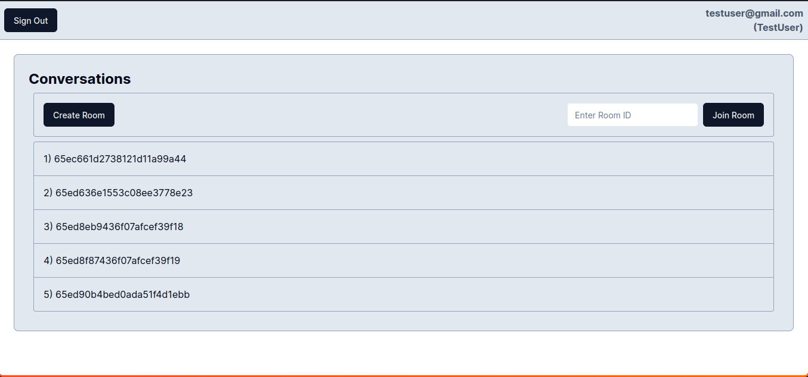
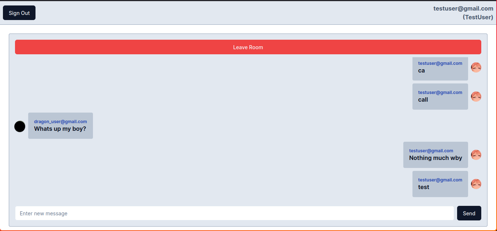

# MERN-ChatAPP

MERN-ChatAPP is a Chat app created using the MERN stack together with Next JS.

It allows each user to create/join 5 `conversations`(chat rooms)

This app can be freely modified, hosted and scaled for your own purposes, whether you want a personal Chat APP or a new public app. You are also free to use this for educational purposes (if it can serve any).

## How to get started?

The app consists of two parts:

1. The frontend
2. The backend

You need to indiviually set both of these parts. The information on how to get each part set up is done through a `README.md` in their respective folders. Make sure to follow the instructions well.
